### Hi, I'm İlyas Serdar 👋

Senior DevOps Engineer · Computer Science graduate, Özyeğin University

4+ years building and running Kubernetes platforms on-premise, on AWS and
on Azure: CI/CD, infrastructure as code, observability, secret management
and DevSecOps. I also contribute to the open-source tools I use every day.

🥈 2nd place, Cisco Observability CTF (AppDynamics & Splunk)

#### Tech

**Cloud & IaC** 

![Amazon EKS](https://img.shields.io/badge/Amazon_EKS-FF9900?style=flat&logo=data%3Aimage%2Fsvg%2Bxml%3Bbase64%2CPHN2ZyB4bWxucz0iaHR0cDovL3d3dy53My5vcmcvMjAwMC9zdmciIHZpZXdCb3g9IjAgMCAyNCAyNCI%2BPHBhdGggZmlsbD0id2hpdGUiIGQ9Im0xNC42NyA4LjUwNS0yLjg3NSAzLjMzNSAzLjEyOCAzLjY0OGgtMS4xNjhsLTIuODA4LTMuMjc3djMuMzY4aC0uODQyVjguNDIxaC44NDJ2Mi45NDdsMi42MDMtMi44NjNabTcuMjI1IDYuNzUxLTMuMzY5LTIuMDIxVjguNDIxYS40Mi40MiAwIDAgMC0uMjA5LS4zNjRsLTQuODQzLTIuODI1VjEuMTU5bDguNDIgNC45NzZabS42MzUtOS43MjRMMTMuMjY3LjA2YS40MjIuNDIyIDAgMCAwLS42MzUuMzYydjUuMDUzYzAgLjE1LjA4LjI4OC4yMDguMzYzbDQuODQ0IDIuODI2djQuODFhLjQyLjQyIDAgMCAwIC4yMDUuMzYybDQuMjEgMi41MjZhLjQyLjQyIDAgMCAwIC42MzgtLjM2MVY1Ljg5NWEuNDIuNDIgMCAwIDAtLjIwNy0uMzYzWk0xMS45NzcgMjMuMWwtOS44NzItNS4yNDhWNi4xMzVsOC40MjEtNC45NzZ2NC4wODRMNi4wOSA4LjA2NmEuNDIyLjQyMiAwIDAgMC0uMTk1LjM1NXY3LjE1OGEuNDIuNDIgMCAwIDAgLjIyNi4zNzNsNS42NjUgMi45NDhhLjQyLjQyIDAgMCAwIC4zODcgMGw1LjQ5Ni0yLjg0IDMuMzgyIDIuMDNabTEwLjEzNS01LjM1Ni00LjIxLTIuNTI2YS40Mi40MiAwIDAgMC0uNDExLS4wMTNsLTUuNTEgMi44NDctNS4yNDQtMi43Mjl2LTYuNjdsNC40MzYtMi44MjRhLjQyMi40MjIgMCAwIDAgLjE5NS0uMzU1Vi40MmEuNDIxLjQyMSAwIDAgMC0uNjM1LS4zNjJMMS40NyA1LjUzMmEuNDIxLjQyMSAwIDAgMC0uMjA3LjM2M3YxMi4yMWMwIC4xNTYuMDg2LjI5OS4yMjMuMzcybDEwLjI5NyA1LjQ3NGEuNDIxLjQyMSAwIDAgMCAuNDAxLS4wMDRsOS45MTUtNS40NzNhLjQyMi40MjIgMCAwIDAgLjAxMy0uNzNaIi8%2BPC9zdmc%2B)

**Containers** 

**CI/CD** 

**Observability** 

**Security & secrets** 

**Messaging & storage** 

**OS & scripting** 

**AI tools** 

#### Open source

- **[curl](https://github.com/curl/curl)**: keep IP info and connect time when connect fails ([commit](https://github.com/curl/curl/commit/354834bf905f58f7727df60d30eef7cac52f7df8), [#23319](https://github.com/curl/curl/pull/23319)) 
- **[k9s](https://github.com/derailed/k9s)**: mark all rows in the table with ctrl-a ([#4256](https://github.com/derailed/k9s/pull/4256)) 
- **[k9s](https://github.com/derailed/k9s)**: suspend/resume all marked cronjobs ([#4255](https://github.com/derailed/k9s/pull/4255)) 

#### Contact

